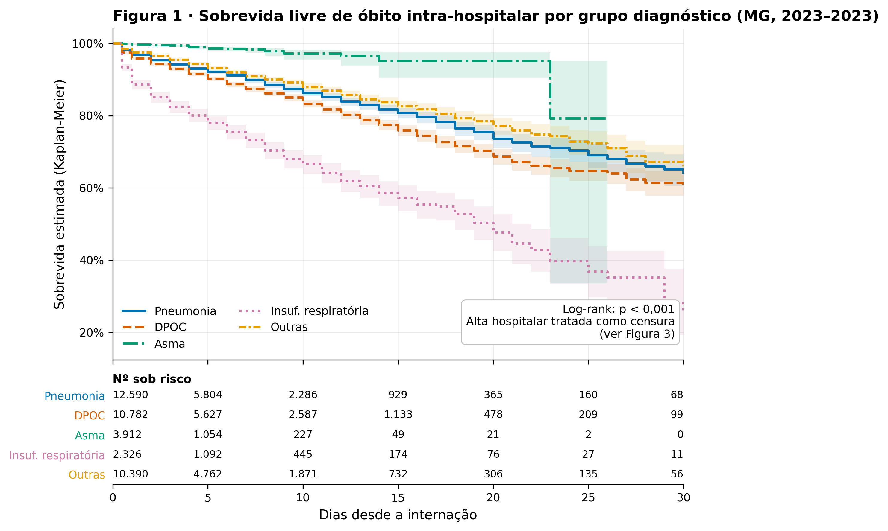
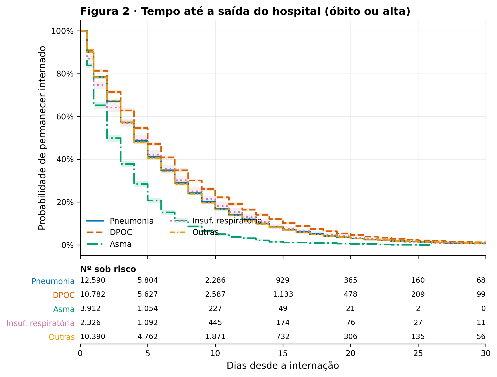
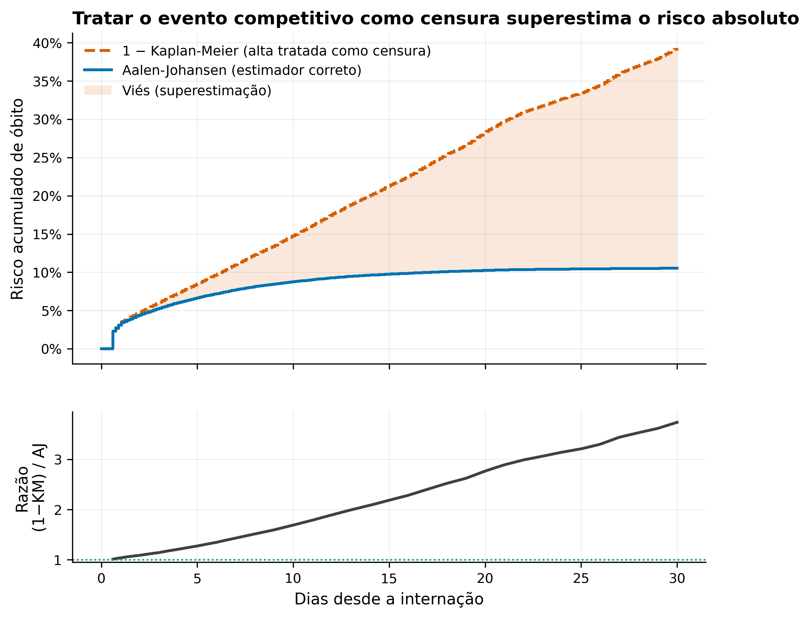
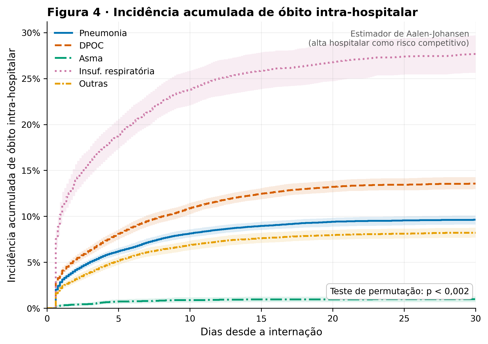
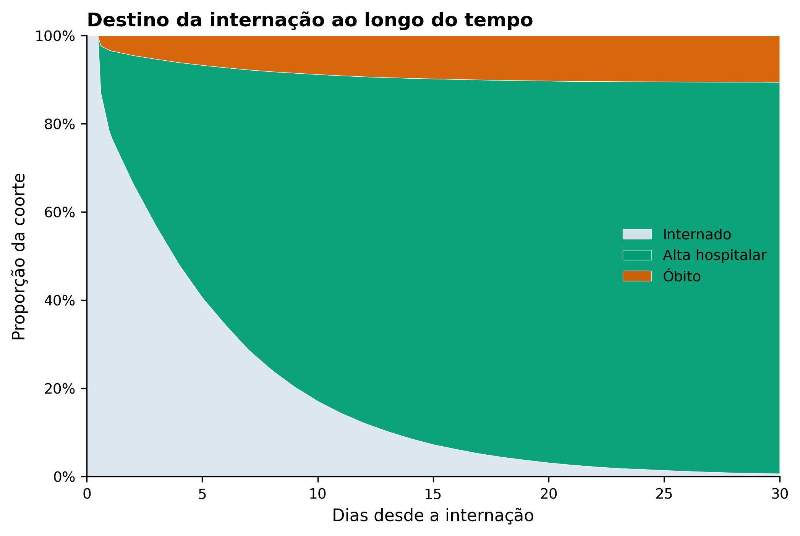
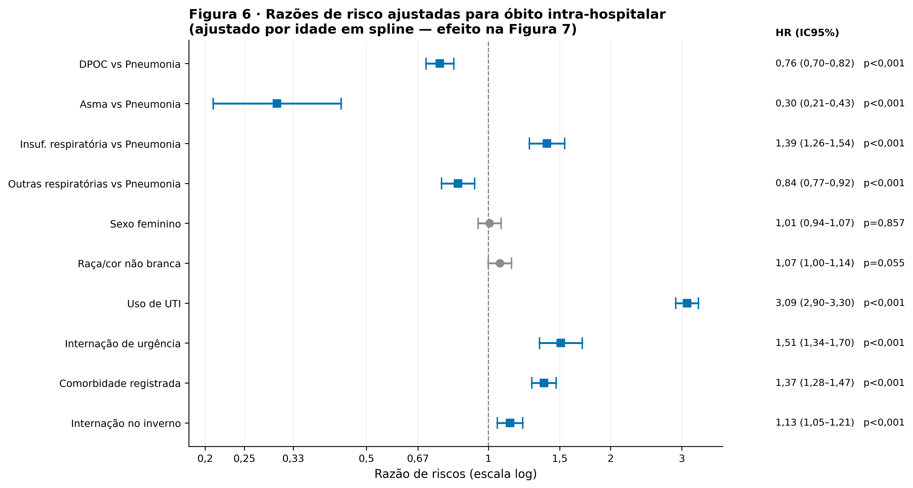
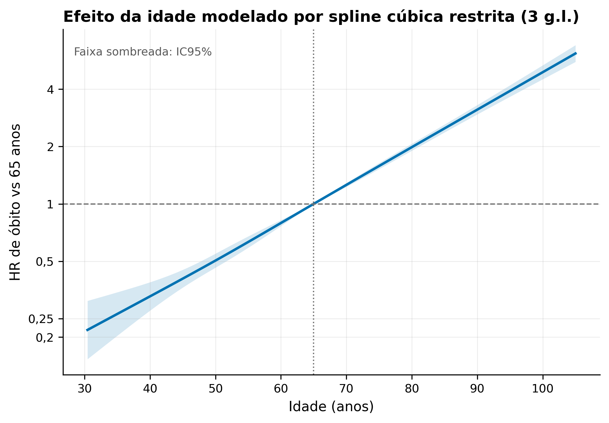
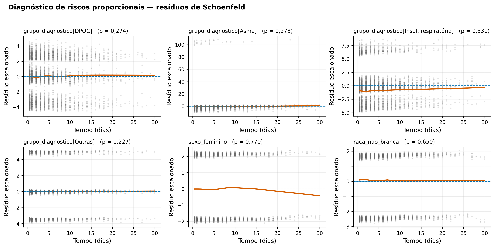
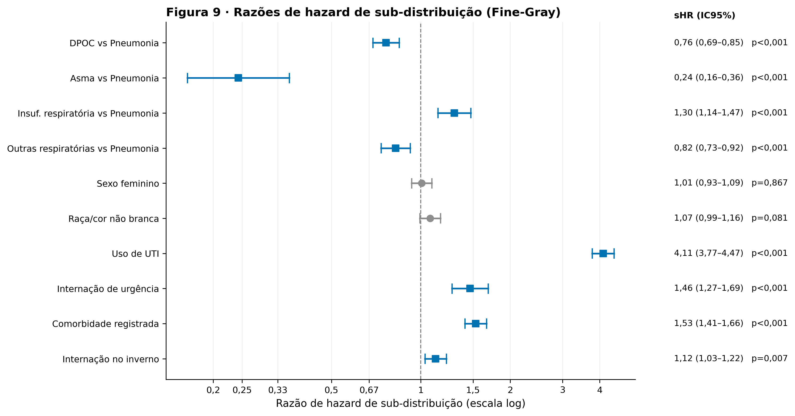

# Resultados — Coorte de internações respiratórias (SIH/SUS)

*Gerado em 2026-08-11 15:23:11 · origem dos dados: **simulado** · tempo de execução: 185 s*

> ⚠️ATENÇÃO: Se a origem for `simulado`, os números são de uma coorte sintética com parâmetros conhecidos e **não** têm validade epidemiológica.

## Fluxograma de elegibilidade

```
FLUXOGRAMA DE ELEGIBILIDADE (STROBE, Figura 1)
==============================================================
AIH recuperadas do SIH/SUS..........................   40.000
Após excluir AIH de continuação (IDENT=5)...........   40.000   (−0)
Diagnóstico principal J00-99........................   40.000   (−0)
Idade 18-110 anos...................................   40.000   (−0)
Permanência válida (0-365 dias).....................   40.000   (−0)
Coorte analítica....................................   40.000   (−0)
  (com raça/cor ausente — mantidos, imputados na sensibilidade)    3.478
```

## Síntese

- Coorte: **40.000** internações; **4.011** óbitos (10.03%).
- Log-rank global entre grupos diagnósticos: p = 4.37e-197.
- Superestimação do risco por 1−KM em 30 dias: **273%** acima da incidência acumulada de Aalen-Johansen.
- C-index corrigido por otimismo: **0.808**.

## Tabelas

- [`tabela1_caracteristicas`](tabelas/tabela1_caracteristicas.md)
- [`tabela2_densidade_incidencia`](tabelas/tabela2_densidade_incidencia.md)
- [`tabela3_km_resumo`](tabelas/tabela3_km_resumo.md)
- [`tabela4_rmst`](tabelas/tabela4_rmst.md)
- [`tabela4b_rmst_contrastes`](tabelas/tabela4b_rmst_contrastes.md)
- [`tabela5_cif_30dias`](tabelas/tabela5_cif_30dias.md)
- [`tabela6a_cox_univariavel`](tabelas/tabela6a_cox_univariavel.md)
- [`tabela6b_cox_multivariavel`](tabelas/tabela6b_cox_multivariavel.md)
- [`tabela7a_causa_especifica`](tabelas/tabela7a_causa_especifica.md)
- [`tabela7b_causa_especifica_alta`](tabelas/tabela7b_causa_especifica_alta.md)
- [`tabela7c_finegray`](tabelas/tabela7c_finegray.md)
- [`tabela8_cs_vs_finegray`](tabelas/tabela8_cs_vs_finegray.md)
- [`tabela_s1_dados_ausentes`](tabelas/tabela_s1_dados_ausentes.md)
- [`tabela_s2_logrank_global`](tabelas/tabela_s2_logrank_global.md)
- [`tabela_s3_logrank_pareado`](tabelas/tabela_s3_logrank_pareado.md)
- [`tabela_s4_km_vs_aj`](tabelas/tabela_s4_km_vs_aj.md)
- [`tabela_s5_schoenfeld`](tabelas/tabela_s5_schoenfeld.md)
- [`tabela_s6_cox_estratificado`](tabelas/tabela_s6_cox_estratificado.md)
- [`tabela_s7_validacao_bootstrap`](tabelas/tabela_s7_validacao_bootstrap.md)
- [`tabela_s8_evalues`](tabelas/tabela_s8_evalues.md)

## Figuras

### fig1_kaplan_meier_grupos



### fig2_permanencia_hospitalar



### fig3_vies_km_vs_aalen_johansen



### fig4_incidencia_acumulada



### fig5_estados_empilhados



### fig6_forest_cox



### fig7_hr_idade_spline



### fig8_schoenfeld



### fig9_forest_finegray


